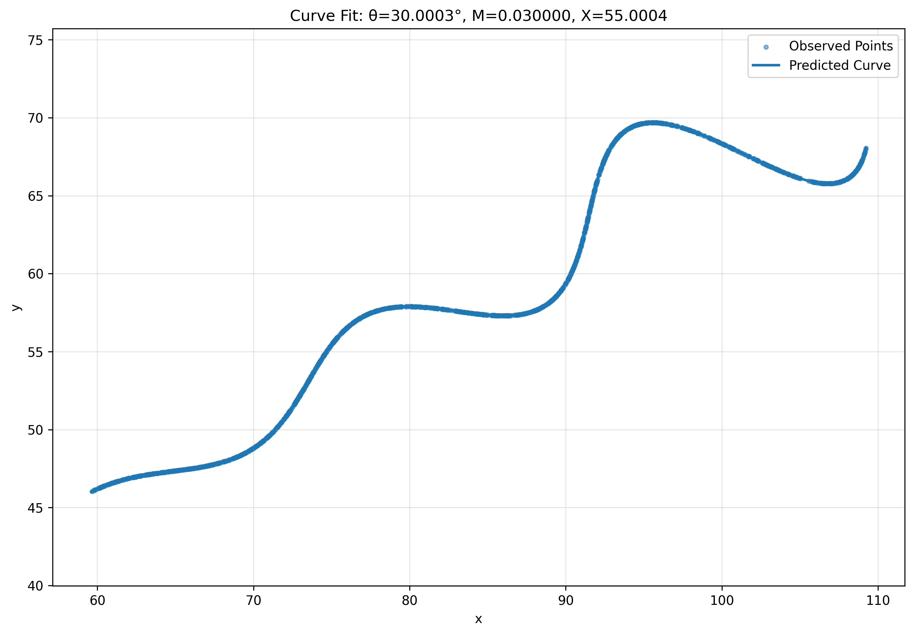

# FlamAI Research and Development / AI Assignment

## Problem Statement

The objective of this assignment is to estimate the unknown parameters of the given parametric curve using the provided dataset `xy_data.csv`.

The parametric equations are:

\[
x = t\cos(\theta) - e^{M|t|}\sin(0.3t)\sin(\theta) + X
\]

\[
y = 42 + t\sin(\theta) + e^{M|t|}\sin(0.3t)\cos(\theta)
\]

The unknown parameters are:

- \(\theta\)
- \(M\)
- \(X\)

### Parameter Constraints

| Parameter | Range |
|---|---|
| \(\theta\) | \(0^\circ < \theta < 50^\circ\) |
| \(M\) | \(-0.05 < M < 0.05\) |
| \(X\) | \(0 < X < 100\) |
| \(t\) | \(6 < t < 60\) |

---

## Approach

The problem was formulated as a bounded nonlinear parameter estimation problem.

The following steps were performed:

1. Loaded the provided `xy_data.csv` dataset.
2. Extracted the observed \(x\) and \(y\) coordinates.
3. Implemented the given parametric curve.
4. Uniformly sampled the parameter \(t\) over the range \(6 < t < 60\).
5. Used Manhattan distance (\(L_1\)) to measure the geometric difference between the observed and predicted curves.
6. Used `Differential Evolution` for global optimization within the given parameter bounds.
7. Applied `Nelder-Mead` optimization for local refinement.
8. Generated the final predicted curve using the estimated parameters.
9. Calculated the final \(L_1\) matching loss.

---

## Optimization Method

### Global Optimization

`Differential Evolution` was used to search for the optimal values of \(\theta\), \(M\), and \(X\) within the specified parameter ranges.

### Local Refinement

The solution obtained from the global optimization stage was refined using the `Nelder-Mead` optimization algorithm.

---

## Distance Metric

The assignment emphasizes the \(L_1\) distance between the expected and predicted curves.

For geometric curve matching, Manhattan distance was used:

\[
d_{L_1} = |x_1 - x_2| + |y_1 - y_2|
\]

A symmetric nearest-neighbour matching approach was used to measure the distance between the observed and predicted curves.

---

## Final Estimated Parameters

The optimization produced the following results:

| Parameter | Estimated Value |
|---|---:|
| **Theta (degrees)** | **30.0003203°** |
| **Theta (radians)** | **0.523604366** |
| **M** | **0.02999924** |
| **X** | **55.0042683** |
| **Final L1 Loss** | **0.022590848** |

The estimated values are very close to:

\[
\boxed{\theta = 30^\circ}
\]

\[
\boxed{M = 0.03}
\]

\[
\boxed{X = 55}
\]

---

## Final Parametric Equation

Using the estimated parameters:

\[
x = t\cos(0.523604366)
- e^{0.02999924|t|}
\sin(0.3t)
\sin(0.523604366)
+ 55.0042683
\]

\[
y = 42
+ t\sin(0.523604366)
+ e^{0.02999924|t|}
\sin(0.3t)
\cos(0.523604366)
\]

where:

\[
6 < t < 60
\]

---

## Result Visualization

The graph below compares the observed points from the dataset with the curve generated using the estimated parameters.



---

## Project Structure

```text
FlamAI-RD-AI-Assignment/
│
├── FlamAI_AI_Assignment.ipynb
├── xy_data.csv
├── results.png
├── estimated_parameters.csv
├── requirements.txt
└── README.md
